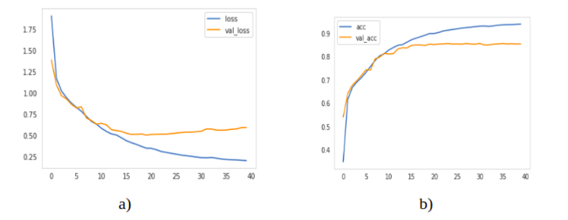

# Semantic Segmentation With Multi Scale Spatial Attention
Code for the paper `Semantic Segmentation With Multi Scale Spatial Attention For Self Driving Cars`.


Link to [Paper](https://abhinavsagar.github.io/files/sem_seg.pdf).

## Abstract

In this paper, we present a novel neural network using multi scale feature fusion at
various scales for accurate and efficient semantic image segmentation. We have
used dilated convolutional layers in downsampling part, transposed convolutional
layers in the upsampling part and used concat layers to merge them. We used skip
connections in between alternate blocks which are comprised of convolutional and
max pooling layers. We present an in depth theoretical analysis of our network
with training and optimization details. We evaluated our network on the Camvid
dataset using mean accuracy per class and Intersection Over Union (IOU) as the
evaluation metrics on the test set. Our model outperforms previous state of the
art networks on semantic segmentation achieving mean IOU value of 74.12 while
running at >100 FPS.

## Data

The dataset can be downloaded from [here](http://mi.eng.cam.ac.uk/research/projects/VideoRec/CamVid/).

Set up the folders in the following manner:

```
├── "dataset_name"                   
|   ├── train
|   ├── train_labels
|   ├── val
|   ├── val_labels
|   ├── test
|   ├── test_labels
```

## Network Architecture


## Usage

Training: `python train.py`

Testing: `python test.py`

Testing on a single image: `python predict.py`

## Results

### Loss/Accuracy vs epochs



### Comparision with SOTA


### Results for predicted image


## Citing

If you find this code useful in your research, please consider citing the paper:

```
@article{sagarsemantic,
  title={Semantic Segmentation With Multi Scale Spatial Attention For Self Driving Cars},
  author={Sagar, Abhinav and Soundrapandiyan, RajKumar}
}
```

## License

```
MIT License

Copyright (c) 2020 Abhinav Sagar

Permission is hereby granted, free of charge, to any person obtaining a copy
of this software and associated documentation files (the "Software"), to deal
in the Software without restriction, including without limitation the rights
to use, copy, modify, merge, publish, distribute, sublicense, and/or sell
copies of the Software, and to permit persons to whom the Software is
furnished to do so, subject to the following conditions:

The above copyright notice and this permission notice shall be included in all
copies or substantial portions of the Software.

THE SOFTWARE IS PROVIDED "AS IS", WITHOUT WARRANTY OF ANY KIND, EXPRESS OR
IMPLIED, INCLUDING BUT NOT LIMITED TO THE WARRANTIES OF MERCHANTABILITY,
FITNESS FOR A PARTICULAR PURPOSE AND NONINFRINGEMENT. IN NO EVENT SHALL THE
AUTHORS OR COPYRIGHT HOLDERS BE LIABLE FOR ANY CLAIM, DAMAGES OR OTHER
LIABILITY, WHETHER IN AN ACTION OF CONTRACT, TORT OR OTHERWISE, ARISING FROM,
OUT OF OR IN CONNECTION WITH THE SOFTWARE OR THE USE OR OTHER DEALINGS IN THE
SOFTWARE.
```

